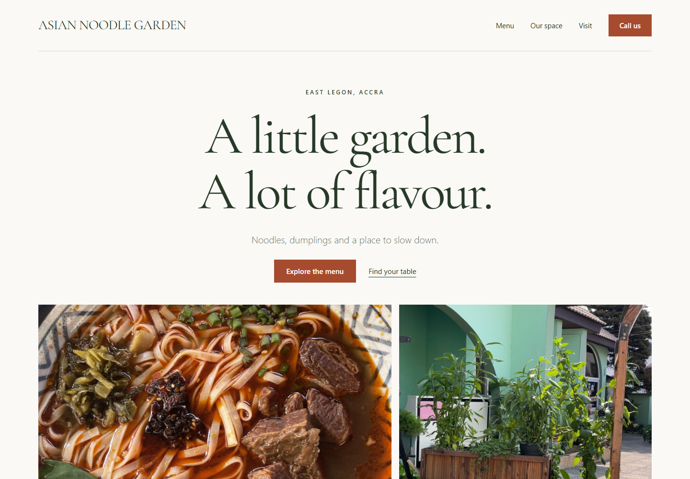
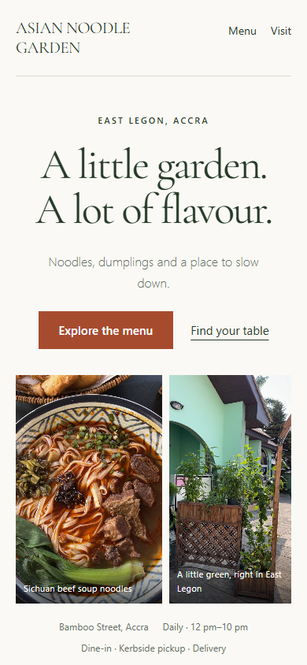

# Asian Noodle Garden — Restaurant Website

An independent restaurant website concept by **Alex Abboud**, designed around food photography, a browsable menu and clear visiting information.

**[Open the interactive website](https://alexabbou9-tech.github.io/SITES-PROJECT/asian-noodle-garden/)**

## Features

- 68 menu entries across seven categories, with keyboard-accessible tabs.
- Ten-page photographed menu viewer.
- Food and venue imagery, opening hours, click-to-call and map directions.
- Responsive desktop and mobile layouts.

## Mobile preview

## Implementation

HTML, CSS and vanilla JavaScript. All required assets are included. Serve this repository with a static web server and open this folder. No build step is required.

## Project context and credits

This is an independent portfolio concept, not a commissioned or approved restaurant website. Menu prices and listed hours reflect the original source material and may change. Photo and information credits remain in the website footer, including [Mame’s Tastes](https://mamestastes.wordpress.com/2024/12/24/asian-noodle-garden/), [Restaurant Guru](https://es.restaurantguru.com/Asian-Noodle-Garden-Accra/menu) and the [restaurant Instagram](https://www.instagram.com/asian_noodle_garden/). Third-party assets remain the property of their respective owners.
