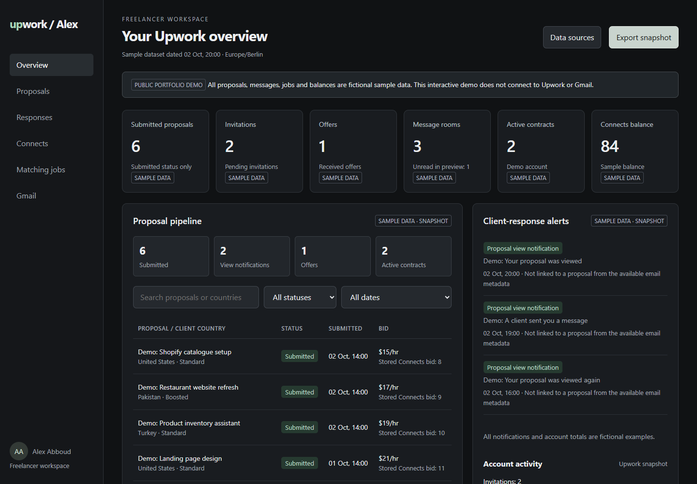
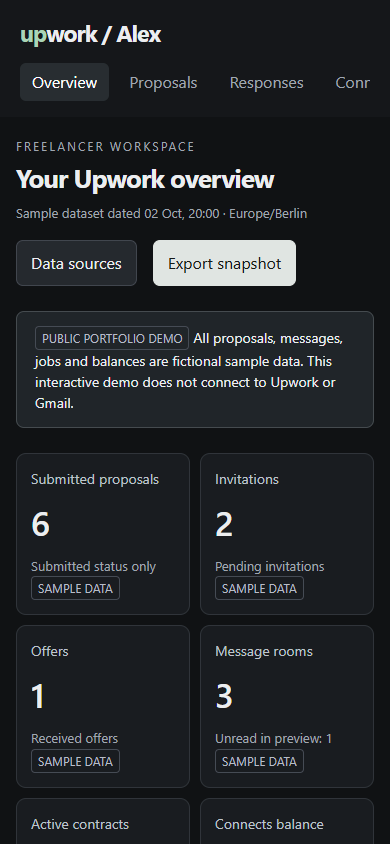

# Upwork Tracker — Interactive Dashboard

A freelancer dashboard portfolio project by **Alex Abboud**, bringing proposal activity, client destinations, notifications and Connects usage into one view.

**[Explore the public demo](https://alexabbou9-tech.github.io/SITES-PROJECT/upwork-tracker/)**

## Features

- Proposal search and status/date filters.
- Keyboard-accessible country markers on a blue world map.
- Notification categories, activity feed and Connects spending chart.
- Job search with country and job-type filters.
- Downloadable JSON sample dataset.
- Responsive layout for desktop and mobile.

## Data and privacy

Every proposal, email, job and balance in this public version is fictional sample data. There are no private account records, account identifiers, email links or credentials. This demo does not connect to Upwork or Gmail, and does not refresh live data. The original private dashboard is separate. This project is not affiliated with Upwork.

## Mobile preview

## Implementation

HTML, CSS, vanilla JavaScript and JSON. Serve the repository with a static HTTP server; fetching the JSON files requires HTTP rather than opening index.html directly from disk. No build step is required.
